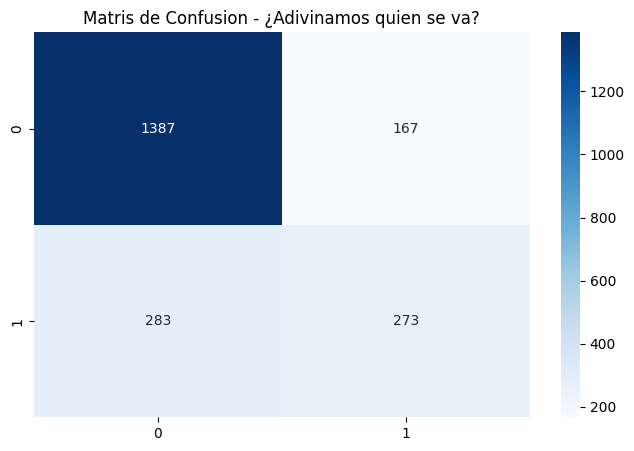
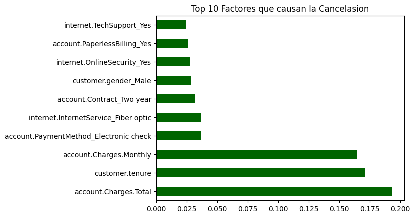

# 🤖 Telecom X - Parte 2: Predicción de Churn con ML

¡Hola! Tras el éxito del analisis exploratorio, ahora pase a la etapa de **Machine Learning**. El objetivo es crear un modelo capaz de predesir que clientes tienen mas riesgo de irse para que la conpañia pueda actuar a tiempo.

## 🧠 Metodología y Pipeline
Para este proyeto de ingenieria, realize los siguientes pasos tecnicos:
1. **Limpesa y Codificasión:** Elimine los IDs de clientes y use `get_dummies` para que las categorias fueran numericas.
2. **Normalisación:** Fue nesesario usar `StandardScaler` para el modelo de Regresión Logistica, para que los montos de dinero no afectaran el calculo.
3. **Modelado:** Entrene un **Random Forest** (basado en arboles) y una **Regresión Logistica**.

## 📊 Vissualisación de Resultados

### Matriz de Confusión
Esta grafica nos muestra que tan bien el modelo adivina quien se va y quien se queda. Ayuda a ver los falsos positivos.

### Importancia de las Variables
Aqui podemos ver cuales son los factores que mas "pesan" en la desisión del cliente segun el modelo de Random Forest.

## 💡 Conclución Estrategica
Tras evaluar los modelos, el **Random Forest** demostro ser el mas preciso. Los hallasgos mas importantes son:
- El **Tipo de Contrato** es el factor mas critico para la evasion.
- Los clientes con cargos mensuales altos tienen un riesgo mayor segun los coefisientes del modelo.
- **Recomendación:** Implementar un sistema de alertas cuando el gasto mensual supere los $70 USD en contratos de mes a mes.

